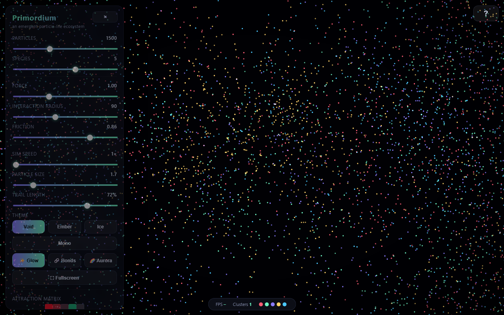

# Primordium

*An emergent particle-life ecosystem that runs entirely in your browser — no
build step, no dependencies, no network.*

Open `index.html` and watch. A few hundred coloured dots, each obeying nothing
more than "how do I feel about that other colour nearby?", spontaneously
organise into cells, membranes, chasers, oscillators and slowly-healing
structures. Nobody coded the structures. They are what the rules *do*.

## How it works

Every particle belongs to one **species** (a colour). An **attraction matrix**
says how strongly each species is pulled toward or pushed away from every other
species — including itself. Below a short range, *all* particles repel (so they
never collapse to a point); in the outer shell the species-specific force takes
over. That's the whole model. Everything else is emergence.

Neighbour lookups use a spatial hash grid, so it stays smooth with thousands of
particles.

## Controls

| | |
|---|---|
| **Sliders** | particle count, species, force, interaction radius, friction, sim speed, particle size, trail length |
| **Attraction matrix** | click a cell to cycle attraction (green) ↔ repulsion (red); right-click randomises it |
| **Presets** | Cells · Chase · Web · Drift — hand-tuned starting rules (keys `1`–`4`) |
| **Themes** | Void · Ember · Ice · Mono recolour the dish |
| **🎲 Surprise me** | randomise *everything* — species, forces, rules, theme — and big-bang it |
| **✨ Glow / 🔗 Bonds / 🌈 Aurora** | additive luminosity; faint links between attracting neighbours; slowly cycling hues |
| **💥 Big Bang** | collapse to the centre and explode outward |
| **🧬 Evolve** | let the rules slowly drift so the ecosystem never settles |
| **Ambience** | a procedural soundscape, fully synthesized (no audio files): stack 🔥 Fire · 🌬️ Wind · 🌧️ Rain · 🐦 Birds · 📻 Noise, plus a 🎵 saw-wave **Melody** that improvises an original lead over a brooding chord progression — never the same twice. Every layer slowly drifts and breathes with the swarm's motion |
| **Space — reverb** | real convolution reverb from a synthesized impulse response: Room · Hall · Cathedral · Cave, plus a 🔁 **Echo** (feedback delay) |
| **📷 PNG / 🎬 Record** | export a still frame, or capture a WebM video clip |
| **⛶ Fullscreen** | fill the screen |
| **Save / Load / Share** | persist the full state to this browser, or copy a link that encodes it |

It auto-pauses when the tab is hidden, so it never wastes CPU in the background.
The HUD shows a live **FPS** readout (green / amber / red), an estimated
**cluster** count, and a colour legend for the active species. It honours
`prefers-reduced-motion` (skipping the explosive intro), labels its icon
buttons for screen readers, and reflows to a bottom sheet on small screens.

The world is **toroidal** — it wraps seamlessly at every edge (forces *and*
rendering wrap), so structures drift off one side and reappear on the other
without tearing. **Left-drag** to attract particles toward the cursor,
**right-drag** to push them away.

### Keyboard

`Space` pause · `R` randomise rules · `S` surprise · `1`–`4` presets ·
`G` glow · `B` bonds · `A` aurora · `E` evolve · `T` trails · `F` fullscreen · `H` panel ·
`?` help · left-drag attract · right-drag repel · double-click to drop a new colony.

Append **`?nointro`** to the URL to skip the title card — handy for kiosk
displays, embeds or screenshots.

## Files

- `index.html` — markup, styling, intro card
- `sim.js` — physics: spatial grid, force model, integration, rendering
- `ambience.js` — procedural soundscape: noise/oscillator layers, saw melody, convolution reverb + echo
- `progression.js` — the chord progression as `[blockDurationMs, [midiPitches]]` data
- `ui.js` — sliders, matrix editor, presets, Evolve
- `tools.js` — PNG export, video capture, save / load / shareable URL, fullscreen

Built in one sitting, June 2026. Have a poke at the matrix — that's where the
magic lives.
